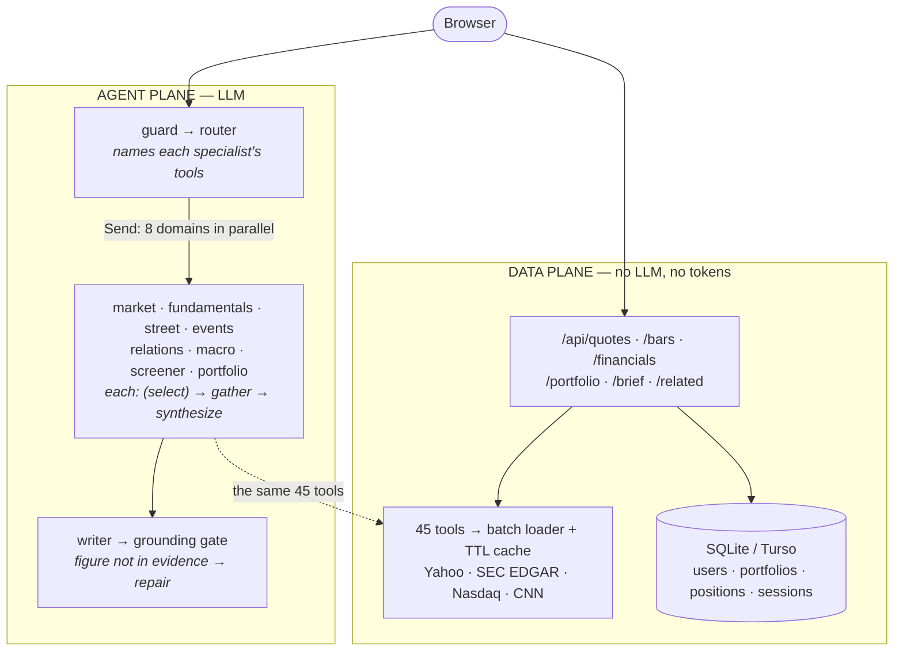

# Monsoon

Agentic research terminal. Broker-style dashboard, multi-agent research engine.

## Architecture

**The problem.** A dashboard needs a live number in every tile. An LLM in that
path would be slow, cost tokens per refresh, and can invent a figure. But the
questions worth asking — "how is this performing", "does that peer's earnings
move my stock" — need reasoning over many sources at once.

**The design.** Split them. Nothing that renders a number touches a model;
nothing that reasons touches the UI's hot path.



**Multi-agent vs plain tool calling**

| | What | Why |
|---|---|---|
| **Multi-agent** | `/api/agent/ask` — router fans out to 8 domain subgraphs in parallel, each `gather → synthesize` (the router names the tools; a specialist picks its own only when it was not told) | Each domain sees only its own tool catalog and its own evidence, never another's. Measured against one-agent-per-tool on the same questions: **~1/4 the LLM calls and ~35% of the tokens** ([ABLATION.md](evals/ABLATION.md)). |
| **Single-agent tool calling** | `/api/agent/analyze` — one domain subgraph, no router, no writer. 1–2 LLM calls. | The per-tab Analyze button already knows its domain, so routing would be waste. |
| **No LLM at all** | every endpoint the UI renders from | Deterministic, cacheable, free. A 20-ticker watchlist is **one** HTTP request and zero tokens. |

**Why it is built this way**

- **Grounding is a gate, not a hope.** Every figure in an answer is checked
  against the evidence that produced it; an unsupported one goes back for repair
  before the answer ships.
- **Relationships are measured in code, explained by the model.** Asked cold, an
  LLM will assert that two AI names move together. The peer and event-study
  tools compute correlation, beta and a baseline, and the model only narrates
  what came back.
- **Database: SQLite**, one file, no server ([DATABASE.md](DATABASE.md)). Every
  row is scoped to a `user_id`, enforced in the application and tested by a
  probe that has one account attack another's ([SECURITY.md](SECURITY.md)).
  Set `TURSO_DATABASE_URL` to run the same schema hosted. Redis is an optional
  second cache tier, off by default.

## Accounts

Sign-in is username + password (argon2id). Google sign-in is scaffolded in
`backend/app/auth.py` but not wired up yet.

You do not have to sign in. A guest gets the whole product — quotes, charts,
research, the agent, a market-wide daily brief — but no watchlist and no
portfolios, because those belong to an account. Try to save something and the
sign-in sheet appears, and whatever you were doing is replayed once you are in.

Set `AUTH_ENABLED=false` to run the old single-implicit-user mode with no login
at all. Design notes and what the auth cases cover: [evals/AUTH.md](evals/AUTH.md).

There is **no row-level security** — SQLite has no such feature. Isolation is
enforced in the application and tested directly by a probe that has one account
attack another's ids across every endpoint. The model, its weak link, and what
real RLS would take: [SECURITY.md](SECURITY.md).

## What is real vs. seeded

Everything **market-facing is live** — prices, names, logos, candles, SEC
financials, news, analyst ratings, earnings dates.

The **starting watchlist and holdings are demo placeholders.** Share counts and
cost basis are invented, so the portfolio total is live arithmetic over fake
holdings until you replace them. The app says so on first run and the numbers
become yours the moment you edit anything:

- **+ Add** next to Positions — enter ticker, shares, average cost
- Hover a holding to edit or delete it
- Hover a watchlist row to remove it
- `POST /api/reset` clears everything

Adding the same ticker twice averages the cost basis rather than duplicating
the lot.

## Run

```bash
python3.13 -m venv .venv && ./.venv/bin/pip install -r requirements.txt
./.venv/bin/uvicorn app.main:app --app-dir backend --port 8077 --reload
```

Open http://localhost:8077

### Views

| Route | What it is |
|---|---|
| `#/dashboard` | book summary, watchlist table, allocation, biggest movers |
| `#/t/SYMBOL` | ticker research — chart + Overview/Financials/News/Analysts/Events |
| `#/portfolio` | named accounts (401k / Roth / taxable) with inline add / edit / delete |
| `#/brief` | daily brief — threshold moves with reasons, adjacent names, macro |

The agent panel is collapsible (the sparkle icon at the bottom of the nav rail,
or press <kbd>/</kbd> anywhere). It is a conversation: the last three turns go
back to the server, so "what about AMD?" or "why?" is read against what came
before, and the answer says how it was read ("Read as: …"). On a ticker page
the ticker you are looking at is context, not a constraint — "how does it
compare with AMD?" still fetches AMD. Each answer shows which specialists ran,
live, and a figure-checked badge; **Evidence** opens what they fetched. Every
research tab also has an **Explain** button: one specialist, one or two model
calls, no router.

It can also **find** stocks, not only study the ones you name. "Find small caps
with fast revenue growth" or "cheap, profitable mid caps in healthcare" goes to a
screener specialist that filters the whole US market (Nasdaq's list, ~7,000
names) by size, sector and style, with a liquidity floor and no penny stocks,
then enriches the shortlist with P/E, 52-week range, growth and margins. The
answer is a screen against stated criteria, never a list of picks. The agent
panel has a small screener builder for this.

A build stamp sits under it — if you don't see one, you're on a cached page.

**The dashboard needs no API key.** Quotes, charts, financials, news, analysts,
events, and portfolio P&L all work with zero configuration.

For the agent, set a key (free at https://aistudio.google.com/apikey):

```bash
export GEMINI_API_KEY=...
```

Optional: `SEC_USER_AGENT="you <you@example.com>"` — the SEC returns 403 for any
User-Agent without an email-shaped contact.

## Hosting

Running it locally needs nothing but `.env.example`. Putting it on the internet
changes three things that are easy to get wrong — an ephemeral filesystem eats
a SQLite database on every deploy, `APP_BASE_URL` is what decides whether your
session cookie is marked `Secure`, and your host assigns the port. Full env
table and the gotchas: [HOSTING.md](HOSTING.md).


## Data sources

- **Yahoo** (via yfinance) — quotes, bars, ownership, analysts, calendar.
  `v7/finance/quote` batches up to 100 symbols in one request; a DataLoader in
  `cache.py` coalesces per-ticker calls into it automatically.
- **SEC EDGAR XBRL** — financial statements. Authoritative, no key. The one
  source here with a real API contract.

yfinance is an unofficial scraper: no SLA, no versioned contract. Fine locally;
don't deploy it publicly as the backbone.

## Evals

```bash
./.venv/bin/python -m evals.run            # deterministic, spends no tokens
./.venv/bin/python -m evals.run --agent    # adds the golden set (spends tokens)
./.venv/bin/python evals/negative_control.py
```

The negative control matters more than the pass count: it sabotages real
defences and asserts the matching case goes red. A green suite you have never
watched fail proves nothing. Reports land in `evals/REPORT.md`.

The golden set checks mechanics, and passes. Whether an answer is any *good* is
a different question, and `evals/quality.py` measures it: fifteen realistic
questions (including follow-ups that only make sense with the turn before),
answered by two versions of the agent, then judged side by side by a different,
validated model — see [evals/QUALITY.md](evals/QUALITY.md).

```bash
./.venv/bin/python -m evals.quality --tag base --no-judge   # collect answers
./.venv/bin/python -m evals.quality --tag new --no-judge
./.venv/bin/python -m evals.quality --pairwise base new     # one judge call per question
```

| Suite | What it covers |
|---|---|
| App sweep | every route end to end on a throwaway db — [evals/SWEEP.md](evals/SWEEP.md) |
| Tenancy | one account attacking another's ids — [SECURITY.md](SECURITY.md) |
| Auth + Sign-in | hashing, throttling, the whole login round trip — [evals/AUTH.md](evals/AUTH.md) |
| Data plane / Tools | the 45 tools and the endpoints the UI reads |
| Regressions | one case per bug found during the build, each saying which |
| Agent | the golden set, routing and grounding (spends tokens) |
